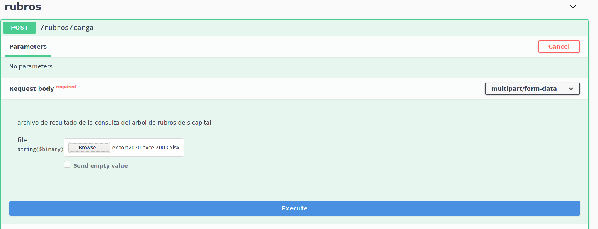
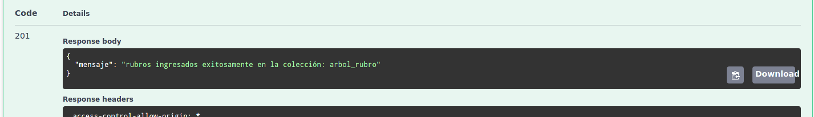
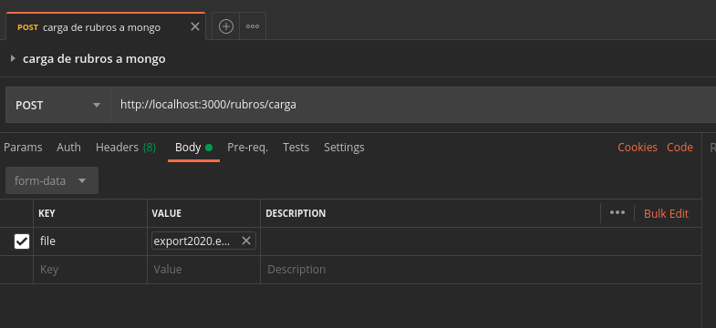

# Cargar Rubros Mongo

Es un api construida en [Nest Js](https://nestjs.com/) con la finalidad de transformar lo datos de los rubros que se almacenan en sicapital a un formato json el cual recibira la base de datos en MongoDB , dicha información de los arboles de rubros siendo consumida con el api de [plan_cuentas_mongo_crud](https://github.com/udistrital/plan_cuentas_mongo_crud)

## Proceso realizado por el api

- el api recibe un archivo `.xlsx` el cual es resultado de la consulta de los rubro de sicapital

- el api interpreta el archivo y lo convierte a formato json

- se procesa el json analizando campos y valores con la finalidad de armar el json que recibe la base de datos de mongo, este proceso se agiliza gracias a poder iterar dinamicamente con los campos json y con [metodos de los array](https://javascript.info/array-methods).

- finalizando ingresa toda la informacion en la base de datos.

## Instalacion y Ejecución

El api esta desarrollada en un framework de javascript que usa typescript , para su facil instalación se ha dockerizado.

### Requisitos

- [Docker](https://www.docker.com/)
- [Docker Compose](https://docs.docker.com/compose/)
- Tener conocimiento de la base de credenciales de la base de datos a ingresar los datos

- el documento de excel debe de tener minimo las siguientes columnas:
  - DESC_NIVEL1
  - CADENA_NIVEL1
  - DESC_NIVEL2
  - CADENA_NIVEL2
  - DESC_NIVEL3
  - CADENA_NIVEL3
  - DESC_NIVEL4
  - CADENA_NIVEL4
  - DESC_NIVEL5
  - CADENA_NIVEL5
  - DESC_NIVEL6
  - CADENA_NIVEL6
  - DESC_NIVEL7
  - CADENA_NIVEL7
  - DESC_NIVEL8
  - CADENA_NIVEL8

### Instalación

En el archivo de `docker-compose` se deben de configurar las siguiente variables segun sea el caso:

- **COLLECTION_MONGO** = colección que almacenara el arbol de rubros
- **DB_MONGO** = base de datos que contendra la colección
- **USER_MONGO** = usuario con acceso a la base de datos
- **PASS_MONGO** = contraseña del usuario
- **HOST_MONGO** = url o ip de la base de datos
- **PORT_MONGO** = puerto de la base de datos

**_Nota 1: El api se conecta a una base de datos designada , el api no monta ninguna base de datos_**

**_Nota 2: En caso de no tomar la variable del esquema creara por defecto el esquema `rubros`_**

### Ejecución

En la raiz del proyecto ejecutar los siguiente comandos

```bash
# build del proyecto con docker-compose
docker-compose build

# ejecución del api
docker-compose up
```

### Uso

El api cuenta con su propio **swagger** y adicionalmente se proporciona un archivo json de la colección de postman con el fin de poder importarse en postman y realizar el proceso desde allí adicionalmente la colección de postman contiene un ejemplo del resultado del get del arbol de rubros realizado por el api [plan_cuentas_mongo_crud](https://github.com/udistrital/plan_cuentas_mongo_crud)

#### Usando Swagger

Ingrese al [localhost:3000/api/](http://localhost:3000/api/) alli le aparecera el endpoint a usar y al dar clic en el boton `Try it Out` le permitira seleccionar un archivo de su ordenador el cual se cargara luego de ello darle clic al boton `Execute`



Tardara unos segundos mientras procesa los datos y los ingresa a la base de datos, el mayor tiempo de este proceso es consumido por el ingreso a la base de datos. Despues de ese tiempo mandara un mensaje de exito.



En caso de presentarse errores el api informara de ello

#### Usando Postman

Es similar a la opcion anterior con la diferencia de que primero debe importar [la colección de postman](./documentacion/Rubros_udistrital.postman_collection.json) luego de ello cargar el archivo en la partaña de `Body` , luego enviar la peticion.


